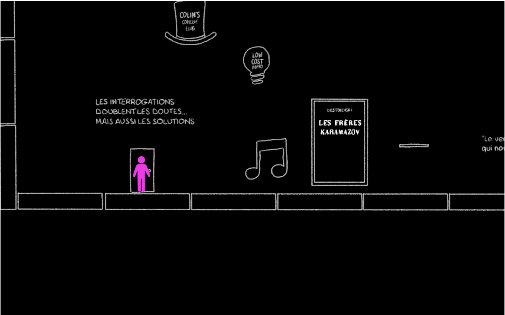
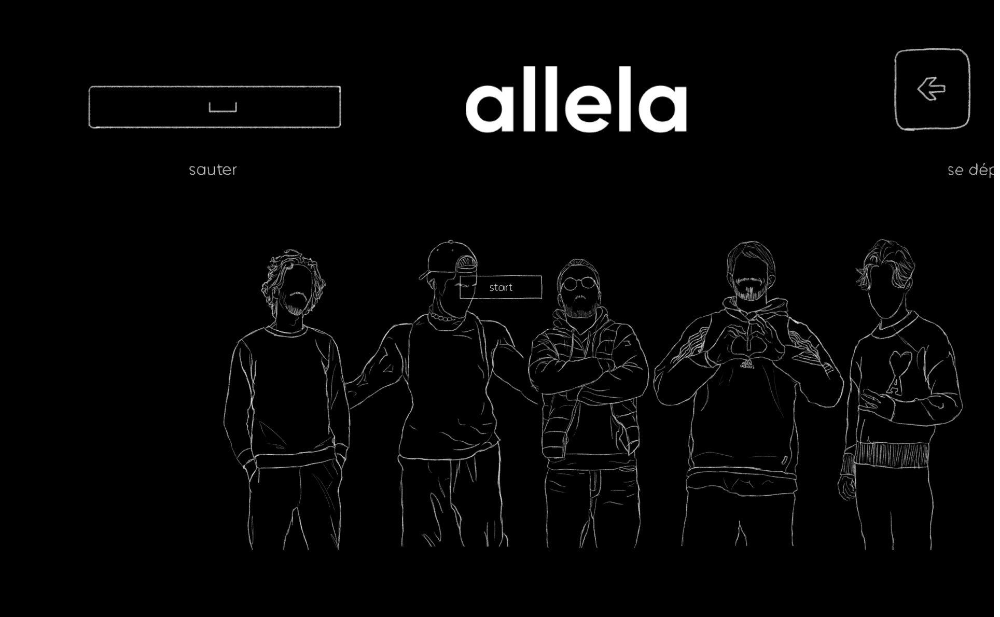

### Overview: 

"Le jeu Allela" is a dynamic and engaging video game developed in Unity as part of a university project. Designed to reflect the vibrant personalities of the members of the <a href="https://www.collectif-allela.com/" style="text-decoration:underline;color:#6366f1">Allela</a>, this game offers players a delightful exploration into the collective's diverse character traits and skills through a series of imaginative challenges and scenarios.

### Objective: 

The main aim of <b>"Le jeu Allela" </b> was to create a fun and interactive experience that both entertains and celebrates the individuality of each member of the Allela Freelance Collectif. The game encourages players to delve into a world where each level and character draws directly from the real-life personalities and talents of its creators, making each gameplay session both unique and personal.

### Technology: 

Utilizing the powerful capabilities of the Unity engine, the game features a somber ambiance, really basic animations, and responsive game mechanics. Each environment is meticulously crafted to ensure that players can fully immerse themselves in a world that is both captivating and reflective of the collectif's creative ethos.

### Impact: 

Beyond simply being a university project, "Le jeu Allela" serves as a playful yet profound homage to the camaraderie and creativity of the group. 

### This one is one of my favorites, we had so much fun !