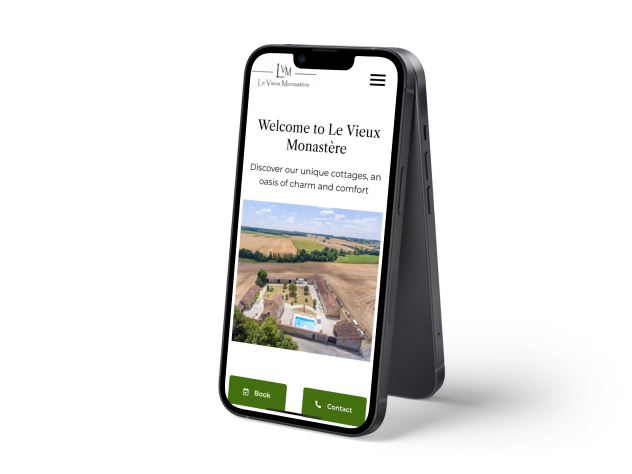

### The context of the project🧑🏻‍💻

As part of my apprenticeship in 2023, while pursuing my position as a full-stack web developer and complementing my Bachelor’s Degree in Multimedia and Internet Studies, I undertook a significant project.

I developed a booking system/CRM from scratch for a cottage rental business in France called Le Vieux Monastère, which is undergoing digital transformation initiatives to enhance customer experience and streamline internal operations.

<li>A fully responsive website created using Wordpress Elementor, seamlessly integrated with Google’s Workspace suite (Google Drive, Sheets, Docs, Mail, Forms, AppScript).

<li>Implementation of a robust booking system capable of:</li>
<ul>
<li>✅ Filtering customer booking requests from the website's booking form.</li>
<li>✅ Generating entries in Google Sheets for future curation and managerial analysis of client viability and availabilities.</li>
<li>✅ Automatically creating events on Google Calendar upon booking validation, facilitating synchronization with third-party platforms like Airbnb and Booking through the iCal API.</li>
<li>Generating contracts utilizing the legal team’s Terms & Conditions and a Google Doc Template, subsequently sent to clients.</li>
<li>✅ If the booking is validated, generates the event on Google Calendar for future synchronisation with third-party organizations such as AirBnb and Booking using the iCal API.</li>
</ul>

✅ And also, creates the contract using the legal team’s Terms & Conditions and a Google Doc Template to then send to the client

## What did I learn ? 🧐

In this project I learnt many things, professionally and personally speaking.

As one of my first professional projects, the stress was high. My actions can develop some bad consequences for the company, such as wrong information sharing, creation of a bad business reputation when something does not work correctly, etc. So must be attentive, focused and always listening to my managers tips and orders, always ready to learn.

### It was an incredible working experience!

Seeing my work being able to contribute to a real business operations and functioning is something I love.

<a href ="https://levieuxmonastere.com/en/home/" style="text-decoration:underline;color:#164b77">Check the website here 👀 </a>
