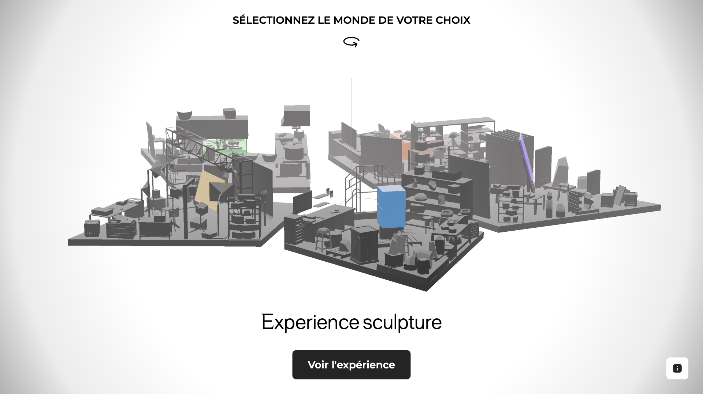

### The context 🧑🏻‍💻

As part of the 2024 graduating class of MMI Bordeaux, we have developed an innovative interactive experience designed specifically for the touchscreen displays at the Musée des Beaux-Arts de Bordeaux (Musba). This engaging installation, set to debut during the European Night of Museums on Saturday, May 18, 2024, utilizes the advanced capabilities of three.js technology to create a dynamic, 3D navigational hub that enhances visitor interaction with the museum's collections.

### What did I developed? 🤓

By leveraging <a href="https://threejs.org/" style="text-decoration:underline;color:#6366f1"> three.js</a>, my team  and I have constructed an intuitive and visually stunning interface that allows visitors of all ages to engage with art in an immersive environment.
 
Users can explore detailed 3D models of artworks, participate in interactive virtual tours, and access multimedia content that brings historical and artistic narratives to life. This technology not only makes the art more accessible but also adds a layer of engagement through interactive storytelling.

Our collaboration with museum curators has ensured that the experience is both educational and entertaining, enriching visitors' understanding and appreciation of art. The interactive hub serves as the centerpiece of this installation, showcasing our technical skills and creative vision in integrating technology with cultural content.

This project highlights the ability of the MMI Bordeaux class of 2024 to innovate and inspire, using our expertise in three.js technology to transform traditional museum visits into memorable, interactive experiences.

