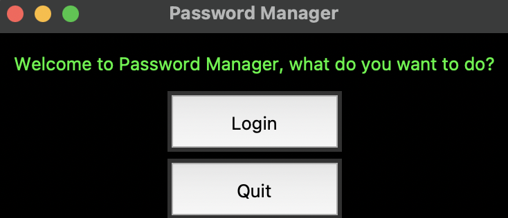
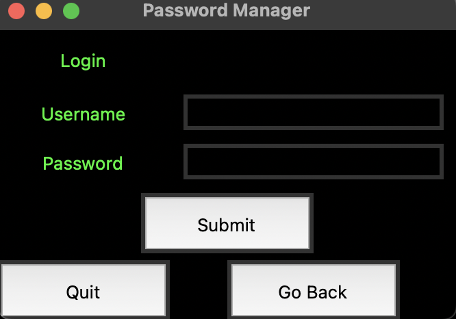
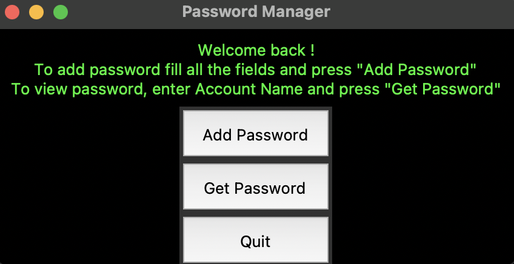
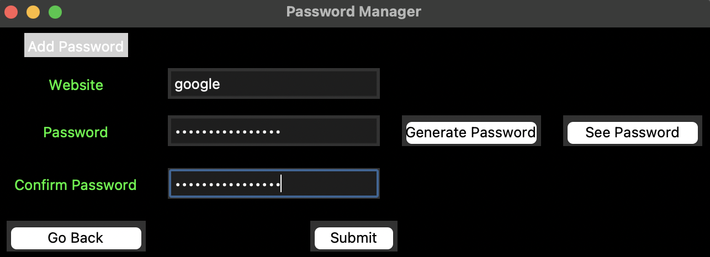
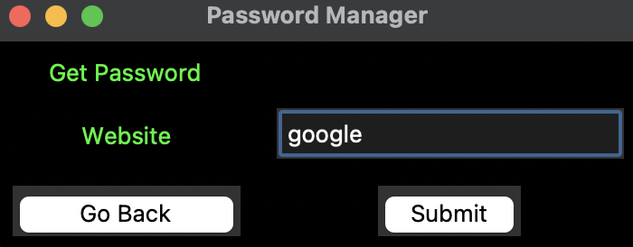

## Overview: 

The SecureKey Password Manager was developed as a submission project for the entrance application to EPITECH School. Tasked with creating a coding project over a weekend, I combined my interest in cybersecurity with my programming skills to develop a comprehensive password management solution. This project showcases a robust, user-friendly application designed to securely store and manage passwords.

## Objective: 

The objective behind SecureKey was to create a practical tool that addresses the common issue of password security. The aim was to develop a system that not only enhances security through encryption but is also accessible and easy to use, leveraging a clean and intuitive user interface.

## Technology: 

SecureKey was built using Python, with the Tkinter UI library for the graphical user interface. This combination allowed for the creation of a straightforward yet effective user experience. The backend of the application features full encryption, ensuring that all stored passwords maintain a high level of security. The project also includes comprehensive documentation, written in English, detailing the functionality and architecture of the application, making it easy for users to understand and utilize.

## Impact: 

My Password Manager played a crucial role in my acceptance into EPITECH School. It was well-received for its practical application, technical proficiency, and alignment with modern cybersecurity practices. Furthermore, the project demonstrated my ability to identify a real-world problem and engineer a functional, user-oriented solution within a tight deadline.

## Outcome: 

This project not only facilitated my entry into one of the most prestigious tech schools in France but also served as a practical exercise to ameliorate both my coding skills and my knowledge on security protocols and standards. 

