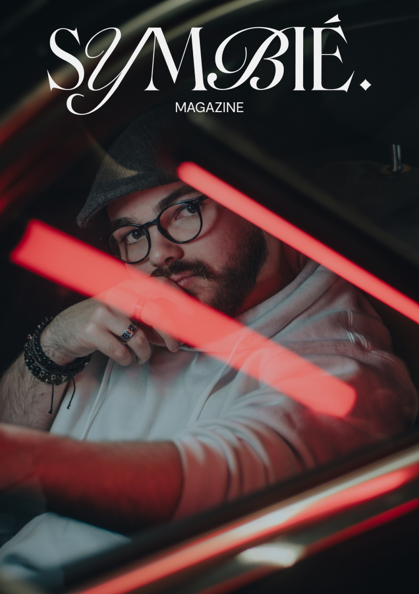
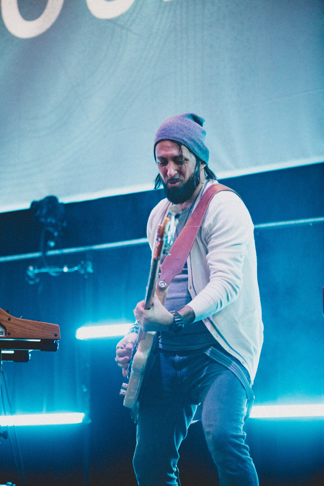

## The context 🧑🏻‍💻

As part of the 2024 Workshop at MMI Bordeaux University, "Symbié Magazine" was conceived during a collaborative fortnight event that united students across three promotions of the degree program. This unique project aimed to challenge societal perceptions and stereotypes by showcasing the successes and stories of disabled and handicapped individuals through professional photoshoots and compelling narratives.

## Objective: 

The primary goal of "Symbié Magazine" was to create a platform that amplifies the voices of disabled and handicapped individuals, portraying them in a light that emphasizes their accomplishments and personal stories. The project sought to not only provide representation but also to inspire and educate the broader community about the diverse capabilities and experiences of these individuals.

## Technology: 

To bring "Symbié Magazine" into the digital realm with a modern twist, advanced three.js technology was utilized to integrate the magazine content in a dynamic 3D online format. This integration allowed for interactive viewing experiences, where readers could engage with the stories and photos in a visually immersive environment, enhancing the impact of each featured narrative.

## Impact: 

"Symbié Magazine" successfully broke new ground in how stories of disabled and handicapped individuals are shared and celebrated. It received acclaim for its innovative approach and meaningful content by the university directors, serving as a powerful tool for advocacy and change within the community. The project also stood as a testament to the creative and technological skills of the students involved, showcasing their ability to address real-world issues through multidisciplinary collaboration.

